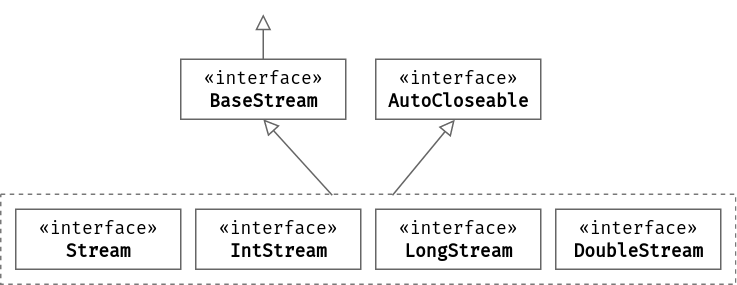

# Потоки данных (streams) в Java

### Потоки ввода и вывода
Бинарные потоки ввода и вывода


Версии Java имеют хорошую (почти всегда) обратную совместимость друг с другом. Однако со временем добавляются новые классы, использование которых удобнее и лаконичнее.

Всегда стоит смотреть *последние* лучшие практики.


### Stream API. Потоки [данных] и коллекции
```java
import java.util.stream.*;
```
Потоки (streams) и коллекции частично взаимозаменяемы.

Коллекции обеспечивают эффективный доступ к одиночным объектам. Стримы предназначены для параллельных и последовательных агрегаций, выполняемых через цепочку методов.


Большинство коллекций и массивы имеют в своём составе методы, которые создают поток на основе данных коллекции:
- `Collection.stream()`,`Collection.parallelStream()` — создание потока из коллекции;
- `Stream.of("a", "b", "c")` — создание коллекции и потока;
- `Arrays.stream(myArray)` — создание потока из массива;\
Другие примеры
- `IntStream ints = IntStream.range(0, 10_000 + 1);` — поток на основе диапазона;
- `IntStream rdInts = new Random().ints(1000);` — поток случайных чисел;
- `Stream.builder()` позволяет добавлять объекты (`.add()`), а потом создавать (`.build()`) из них поток.
- `Stream.generate ( Supplier generator_function )`
- `Stream.concat( Stream stream2 )`

Коллекции и массивы, наоборот, можно создавать из потоков
- `mystream.collect(Collectors.toList())`
- `mystream.collect(Collectors.toCollection(ArrayList::new)`
- `mystream.toArray(String[]::new)`

Stream API — это новый способ работать со структурами данных в функциональном стиле.

Пакет `java.util.stream` содержит классы для поддержки операций с потоками элементов в функциональном стиле. Ключевой абстракцией, введенной в этом пакете, является Поток [ [doc](https://docs.oracle.com/en/java/javase/19/docs/api/java.base/java/util/stream/Stream.html) ].

```
public interface Stream<T> extends BaseStream< T,Stream<T> >
```


Отличия потоков от коллекций:
- не хранят значения;
- поддерживают парадигму функционального программирования, не имеют состояния;
- поддерживаю ленивые (lazy) или отложенные вычисления, что даёт простор для оптимизации;
- могут быть неограниченными;
- по одному и тому же стриму можно пройти только один раз.


Методы потоков (операторы) можно разделить на две группы:

- Промежуточные (intermediate, lazy) — обрабатывают поступающие элементы и возвращают стрим. Промежуточных операторов в цепочке обработки элементов может быть много.
- Терминальные (terminal, eager) — обрабатывают элементы и завершают работу стрима, так что терминальный оператор в цепочке может быть только один.

Обработка не начнётся до тех пор, пока не будет вызван терминальный оператор.

Промежуточных операторов вызванных на одном стриме может быть множество, в то время терминальный оператор только один


Некоторые промежуточные методы
- `Stream<T> filter(Predicate<T> predicate)` -> элементы потока, для которых predicate -> true;
- `<R> Stream<R>
map(Function<T, R> mapper)` преобразует каждый элемент (типа T) в новое значение (типа R) с помощью функции mapper;
- `mapToObj`, `mapToDouble`, `mapToLong`
- `<R> Stream<R> flatMap(Function<T, Stream<R>> mapper)` аналогично map, но умеет обрабатывать вложенные потоки.
- `Stream<T> distinct()` -> различные элементы (сравнение через Object.equals( Object ));
- `Stream<T> sorted()`, `sorted(comparator)`;
- `Stream<T> limit(long maxSize)` -> не более maxSize элементов;
- `Stream<T> skip(long n)` -> пропускает первые n элементов, выдаёт остальные.
- `default Stream<T> takeWhile​(Predicate<? super T> predicate)`

Функциональный интерфейс `Function<T,R>` представляет функцию перехода от объекта типа T к объекту типа R


Некоторые терминальные методы:
- `void forEach(Consumer<? super T> action)` (не гарантирует выполнения в том же порядке, в каком получает данные), `forEachOrdered`
- toArray()
- reduce()
- collect()
- min(), max(), count()
- anyMatch(), allMatch(), noneMatch()
- findFirst(), findAny()


Остальные методы:
- `long count()`
- https://docs.oracle.com/en/java/javase/19/docs/api/java.base/java/util/stream/Stream.html
**Пример filter и forEach**
```java
import java.util.ArrayList;
import java.util.List;

import java.util.stream.Stream;

// список на основе динамического массива
List<String> list = new ArrayList<String>();
// добавление объектов
list.add("One");  list.add("Two");   list.add("Three"); list.add("Four"); list.add("Five");
list.add("Six");  list.add("Seven"); list.add("Eight"); list.add("Nine"); list.add("Ten");

// создание потока на основе коллекции
Stream stream = list.stream();

// создание нового потока в функциональном стиле
// отберём все элементы, которые содержат строки длиной в три символа
Stream short_strs = stream.filter(
                            s -> s.toString().length() == 3     // предикат в виде анонимной функции;
        // параметр анонимной функции всегда Object, но можно преобразовать
        );
// предикат - логическая функция
// после вызова промежуточного метода filter поток не обработан
// вызовем терминальный метод forEach: применение функции к каждому элементу
short_strs.forEach( System.out::println );
```


Методы можно записать короче, одним выражением:
```java
stream.filter( s -> s.toString().length() == 3 )
      .forEach( System.out::println );
```


```java
String[] array = {"Java", "Stream", "API"};
        Stream<String> streamOfArray = Arrays.stream(array);        // коллекция -> поток
        streamOfArray.map( s -> s.split("") )                  // Преобразование слова в массив букв
                .flatMap(Arrays::stream).distinct()                 // создаёт из трёх потоков из потоков один поток
                .collect(Collectors.toList()).forEach(System.out::println);
```


**Пример обработки веб-страниц**
```java
import java.util.stream.IntStream;

public static String get_page(String url);              // -> исходный код страницы
public static List<NewsItem> parse_news(String page);   // -> список из новостей NewsItem из одной страницы
// NewsItem — класс, который хранит всю информацию про новость: заголовок, дату, теги, ...

IntStream.range(1, pages_count + 1)                          // IntStream                   — число
         .mapToObj( i -> get_page(BASE_URL+i ) )         // -> Stream<Strings>          — исходный код страницы
         .map( Main_Streams::parse_news )                // -> Stream< List<NewsItem> > — список NewsItem одной страницы
         .flatMap( news_item -> news_item.stream() )     // -> Stream< NewsItem >       — NewsItem
         .forEach(System.out::println);                  // терминальная операция
```

#### Специальный потоки
Построчное чтение файла:
```java
import java.io.IOException;
import java.nio.file.*; // Files Paths;
import java.util.stream.Stream;

// поток для построчного чтения файла
Stream<String> lines = Files.lines( Paths.get("my_file.txt"));      // throws IOException
lines.forEach(System.out::println);     // чтение, вывод на экран
```

Перебор файлов и папок в текущей директории
```java
import java.io.IOException;
import java.nio.file.Files;
import java.nio.file.Path;
import java.nio.file.Paths;
import java.util.stream.Stream;

Stream<Path> files = Files.list(Paths.get("."));      // throws IOException
// Path — класс для хранения путей к файлам а папкам
files.forEach(System.out::println);

// обход дерева каталогов с ограничением глубины 3
Files.walk( Paths.get( System.getProperty("user.home") ), 3)
        .forEach(System.out::println);
```


#### Генераторы
```java
// бесконечный генератор
Stream.generate( () -> LocalDateTime.now().toString() + ": Exterminate!" ).forEach(System.out::println);
```


#### Многопоточность (multithreading)

Стримы бывают последовательными (sequential) и параллельными (parallel). Последовательные выполняются только в текущем потоке, а вот параллельные используют общий пул ForkJoinPool.commonPool(). При этом элементы разбиваются (если это возможно) на несколько групп и обрабатываются в каждом потоке отдельно. Затем на нужном этапе группы объединяются в одну для предоставления конечного результата.

```java
import java.util.stream.LongStream;
        
long t0 = System.currentTimeMillis();
double sum1 = LongStream.range(1, 10_000_000_000L + 1)
                .parallel()
                .mapToDouble( x -> 1.0 / (1.0 + Math.exp(-x)) )
                .sum();
long t1 = System.currentTimeMillis();
System.out.println( "parallel stream dt = %d milliseconds".formatted(t1-t0));
// dt = 36 seconds


t0 = System.currentTimeMillis();
double sum2 = LongStream.range(1, 10_000_000_000L + 1 )
                .mapToDouble( x -> 1.0 / (1.0 + Math.exp(-x)) )
                .sum();
t1 = System.currentTimeMillis();
System.out.println( "sequential stream dt = %d milliseconds".formatted(t1-t0));
// dt = 117 seconds
        
System.out.println( "Sum = %.2f ".formatted(sum1));
assert sum1 == sum2;
```

#### Пример параллельной обработки двух потоков
В Java нет аналога функции zip из Питона, но можно логко итерироваться по двум коллекциям или потокам обращаясь к ним как к глобальным переменным:
```java

List<String> names = new ArrayList<>(Arrays.asList("John", "Jane", "Jack", "Dennis"));

List<Integer> ages = new ArrayList<>(Arrays.asList(24, 25, 27));
        
IntStream
  .range(0, Math.min(names.size(), ages.size()))
  .mapToObj(i -> names.get(i) + ":" + ages.get(i))
  // ...
```

#### Операция свёртки
```java
int sum = 0;
for (int x : numbers) {
    sum += x;
}
```
Используем метод `T reduce(T identity, BinaryOperator<T> accumulator)`

чтобы записать эквивалентный код:
```java
int sum = numbers.stream().reduce(0, (x,y) -> x+y);
```
Метод reduce принимает два параметра начальное значение для накопительной переменной и анонимную функцию, обладающую свойством ассоциативности.
Анонимная функция принимает тоже два параметра. В первом накапливаются результаты ей выполнения, во второй подставляется значения из потока.
Такой тип операций легко выполнять параллельно, создавая параллельный поток. 

*Ассоциативная операция — операция op, обладающая свойством*: `(a op b) op c == a op (b op c)`

Пример с четырьмя операндами легко поддаются распараллеливанию:
`a op b op c op d == (a op b) op (c op d)`


**См. также метод `collect` и перегруженные варианты метода reduce — [ [doc](https://docs.oracle.com/en/java/javase/20/docs/api/java.base/java/util/stream/Stream.html#reduce(java.util.function.BinaryOperator)) ] 
#  Ссылки
- https://habr.com/ru/company/otus/blog/658999/ - Java Stream API на простых примерах
- [Java documentation](https://docs.oracle.com/en/java/javase/19/docs/api/java.base/java/util/stream/Stream.html)
- https://www.youtube.com/watch?v=RzEiCguFZiY