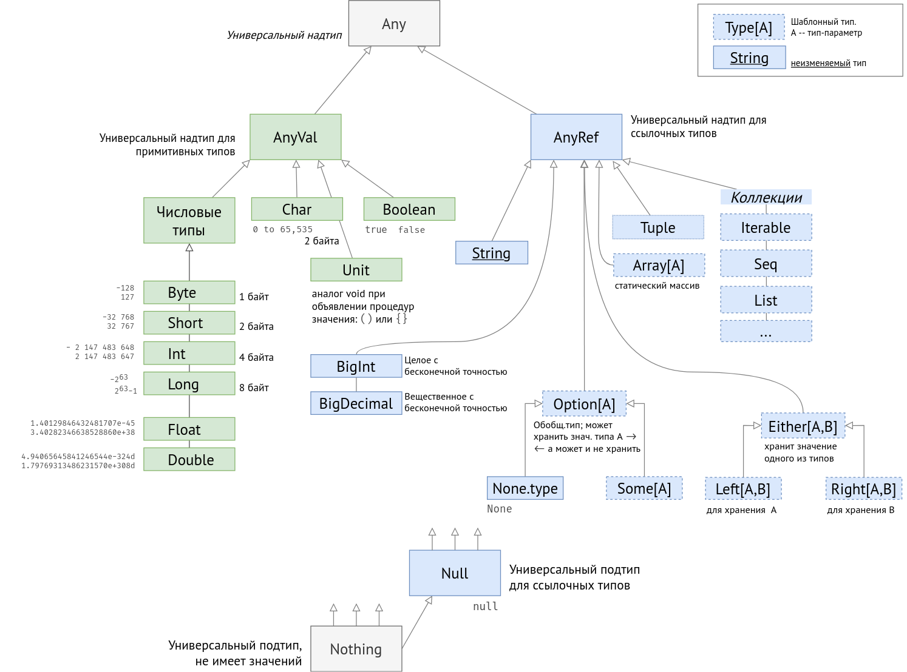

# Scala
# Hello, World!
```scala
@main
def main() =
    println("Hello world!")
    println("Hello world!")
```
`@main` — аннотация, помечающая текущий метод как главную функцию программы.
Тело функции начинается после `=`. Фигурные скобки вокруг тела писать необязательно.

В стандарте Scala 2 нужно создать класс наследник от App, который будет включать основной код


## Система типов
- Статическая типизация
- Местами строгая (нельзя без явного преобразования `val x: Int = 2.3`)
- Возможен автоматический вывод типа для многих ситуаций


#### Типы

Иерархия типов Scala


Возможно приведение к более общим типам (надтипам). Нельзя приводить к подтипам (более частным).

Unit — единичный тип, обозначается как () или {}; используется для возвращаемого типа процедур
При записи всего в переменную типа Unit значение теряется, остаётся только ()
```scala
val x: Unit = 42;            // -> ()
val x: Unit = Math.sin(2);   // -> ()
```

Можно оборачивать действия в скобки и записывать в переменные
```scala
val x: Double = {
val z = 0
Math.cos(2)}
// тип перем. x = тип последнего выражения в скобках
```

#### Числовые литералы
```scala
// разряды можно отделять
val x = 1_000_000
```


## Ввод и вывод

```scala
println("Hello, World!")
print("Hello, World!")
```

```scala
val p = 333.0 / 106            // 3.141509433962264
println( f"pi ≈ $p%7.3f" )

println( f"pi ≈ ${333.0/106}%7.3f" )
```

Вывод
```text
pi ≈   3.143
```


**Ввод**

```scala
// подключение трёх функций из пакета 
import scala.io.StdIn.{readLine, readInt, readLong}

val s: String = readLine()
```
## Строки и регулярные выражения

```scala
val r = "\\w+\\s\\d".r`
// метод r создает на основе строки объект типа scala.util.matching.Regex
r.matches( "some text ")    // -> Boolean
```


## Тестирование

```scala
assert( 4 == 2+2 )
```


## Управляющие операторы
**if** считается выражением. Например:
```scala
import scala.util.Random
val rand = Random
val a = rand.nextInt()
val b = rand.nextInt()
val max = 
    if (a > b) a 
    else b
```

**while** используется редко, т.к. есть рекурсия. break и continue отсутствуют.

**for** более гибок.
```scala
for ( i <- 1 to 10 )
    println(i)
// в обратном порядке
for ( i <- 10 to 1 by -1)
  println(i)
```
Можно указывать произвольное число действий в заголовке цикла. Это создаст вложенный цикл:
```scala
for ( i <- 1 to 10;  j <- 1 to 10)
    print(f"$i,$j  ")
```
Код с фигурными скобками вместо круглых можно записать в несколько строк, не разделяя операторы точкой с запятой.
```scala
for { i <- 1 to 10
      j <- 1 to 10 }
    print(f"$i,$j;  ")
```
В тело цикла можно включить условие, котролирующее изменение счётчика
```scala
for { i <- 1 to 5
      j <- 1 to 5 if i >= j}
    print(f"$i,$j;  ")
```
Вывод
```text
1,1;  2,1;  2,2;  3,1;  3,2;  3,3;  4,1;  4,2;  4,3;  4,4;  5,1;  5,2;  5,3;  5,4;  5,5;

```


### Сопоставление с образцом (Pattern matching)
Проверка сверху вниз. Срабатывает только один case. Если не сработал ни один, то генерируется исключение. 
```scala
import scala.util.Random

val x: Int = Random.nextInt(10)

x match
  case 0 => "zero"
  case 1 => "one"
  case 2 => "two"
  case _ => "other"
```
`_` обозначает любое значение.


Вместо значения в `case` можно указать переменную, в которую это значение запишется. 
Так как переменная будет всегда равна проверяемому значению, такая ветка будет срабатывать всегда.
```scala
import scala.util.Random

val x: Int = Random.nextInt(10)

println(x)

x match
  case x => "always"
```

Но в ветку с переменной можно добавить условие:
```scala
import scala.util.Random

val x: Int = Random.nextInt(10)

println(x)

x match
  case x if (x%2==0) => "even"
  case 1 => "one"
  case 3 => "three"
  case _ => "other"
```

Можно сопоставлять объекты (экземпляры case classes) по отдельным полям. Поля, значение которых не важны заменены на `_`.
В поле можно встроить сравнение по регулярному выражению.
```scala
case class Email(sender: String, title: String, body: String)

//val x = new Email("Spammer", "Not a Spam", "Hello, dear friend")    // send to spam
val x = new Email("Manager", "important!!!!", "Hello, dear friend")          // delete
//val x = new Email("Manager2", "important!!!!", "Hello, dear friend")          // also delete
//val x = new Email("Vasya", "qwerty", "Hello, dear friend")  // do nothing

val title_reg   = "(.*!{2,}.*)".r   // 2 или более восклицательных знака среди всего остального, выражение должно быть в скобках для обозначения места для подставноки строки
val title_reg22 =  ".*!{2,}.*".r     // 2 или более восклицательных знака среди всего остального

x match
// проверка по полю sender, с извлечением значения из поля title в переменную title1
case Email("Spammer", title1, _)           => s"send <$title1> to spam"
// проверка по последнему полю
case Email(_, _, "money")                  => "mark important"
// проверка по точному совпадению с первым полем, извлечение значения второго поля в title22, проверка по регулярному выражению
case Email("Manager", title_reg(title22), _) => "delete"
// значение для проверки в регулярном выражении можно и не извлекать в переменную, ведь и так понятно что туда подставлять
case Email("Manager2", title_reg22(), _) => "also delete"
// если ничего не сработало
case _ => "do nothing"
```

Использование регулярных выражений с извлечением совпадающих частей регулярного выражения в переменные
```scala
import scala.util.matching.Regex
val contact = "JohnSmith@sample.domain.com"

val emailPattern: Regex = """^(\w+)@(\w+(.\w+)+)$""".r
val phonePattern: Regex = """^(\d{3}-\d{3}-\d{4})$""".r

contact match
  case emailPattern(localPart, domainName, _) =>
    println(s"Hi $localPart, we have saved your email address.")
  case phonePattern(phoneNumber) =>
    println(s"Hi, we have saved your phone number $phoneNumber.")
  case _ =>
    println("Invalid contact information, neither an email address nor phone number.")
```


## Функции
**Композиция функций**

```scala
f andThen g      // g( f(x) )
f compose g      // f( g(x) )
```

```scala
val f = (_:Double) + 2
val g = (_:Double) * 3

(f compose g)(1)   // 5
(f andThen g)(1)   // 9
```

### Каррирование (Currying)
Каррирование (карринг) — преобразование функции от многих аргументов в набор функций, 
каждая из которых является функцией от одного аргумента.

Например: f(x,y) преобразуется в f'(x)(y), где f'(x) -- возвращает функцию.

```scala
/** Создаёт новый список на основе старого
 * @param f -- функция фильтрации списка
 * @param lst   -- список из целых чисел
 * @return список чисел, для которых функция f возвращает true
 */
def my_list_filter(f: Int => Boolean, lst: List[Int] ) =
  var filtered: List[Int] = List()        // новый пустой список
  for (element <- lst)                    // перебор элементов списка с записью каждого в element
    if ( f(element) )
      filtered = filtered.appended( element ) // добавление элемента в новый список
  filtered


val isOdd = (_:Int) % 2 == 0        // лямбда, проверяющая чётность числа
  // аналогично: def isOddMethod(x:Int)   =   x % 2 == 0


my_list_filter( isOdd,            List(1,2,3,4))          // -> List(2,4)
my_list_filter( (_:Int) % 2 == 0, List(1,2,3,4))          // -> List(2,4)
my_list_filter( _ % 2 == 0,       List(1,2,3,4))          // -> List(2,4)

// каррирование метода my_list_filter, 
// теперь он возвращает функцию, которая должна принять его второй параметр
// первый параметр уже задан
val oddFilter = my_list_filter.curried( isOdd )

// вызов каррированного метода
oddFilter( List(1,2,3,4) )
```


### Частичные функции (Partial Functions)
Частичная функция содержит в себе оператор match (неявно) и сравнивает значение первого и единственного аргумента 
со значениями в case, при совпадении возвращает значение. 
Первый и второй шаблонные типы должны совпадать с проверяемыми и возвращаемыми значениями.


```scala
val divide10: PartialFunction[Int, Int] = {
    case 1 => 10
    case 2 => 5
    case 5 => 2
    case 10 => 1
}
```
Если вариант case для текущего значения аргумента функции не предусмотрен, то бросается исключение. 
Однако в такую функцию встраивается метод `.isDefinedAt` которым можно проверить, 
определена ли функция для такого значения. 

### Обобщённые функции

## Опциональные значения
Такой тип может содержать значение типа `A`, а может и не содержать
```scala
Option[A]
```

Т.е. у `Option[A]` есть два подтипа
- `Some[A]` -- контейнер Some, гарантированно содержащий значение типа A
- `None`
## Коллекции
### Кортежи


# Ссылки
- [Scala cheatsheet](https://docs.scala-lang.org/cheatsheets/index.html)